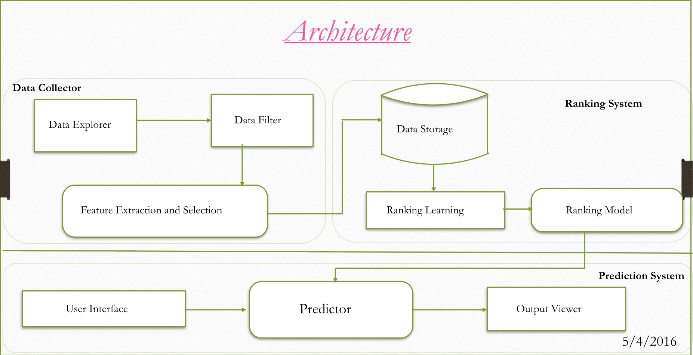

# 2016_Mobile_Games_Ranking_And_Prediciton

### Abstract:
1. Ranking and prediction problems have always been a challenge to rank documents, files, applications etc. 
2. The project aims at providing data analytics, trends and preferred traits of all the games put together at one platform using Gradient Boosting Machine Learning Algorithm.
3. The main purpose of this project will be to help game developers ballpark the number of downloads they will receive for their game.

### Problem Definition:
To develop a Mobile Game Prediction System for top mobile games prediction and providing the range of downloads and estimated Ranking for the games along with the trends and traits of the top games, thereby enabling the developers to design a good game with ease. 
  
### Architecture

### Modules:
  ### *Data Collector:* ###
  * The Data Collector module has three components
    * Data Explorer : It gathers the data from the large sources which are mainly internet ,experts and magazines.
    * Data Filter : Prevents and excludes noise data from the Data Explorer.
    * Extraction and Selection : It includes only the extracted and selected attributes from data.
    
  ### *Ranking System:* ###
  * This module plays a major role where Learning to rank algorithm works. It contains :
    * Dataset Storage: The datasets which are extracted from the feature extraction are stored in this Dataset storage.
    * Ranking Learning: The Learning Ranking component performs training and evaluation using datasets in the Dataset Storage.
    * Ranking Model : It is model container which is ready to be employed for prediction after being trained in Ranking Learning.
    
  ### *Predictor:* ###
  * This predictor works as a User interface module or user view module. It contains three components:
    * Input Interface : This is shown to users as input user interface for the prediction which contains query input.
    * Predictor : It is the main component which predicts new input from the users using model from Ranking Model component.
    * Output Viewer : This delivers the prediction from the Predictor as ranking and is shown in understandable user interface.
